# 🏗️ Arquitectura y Asignación de Roles: Plataforma Comunitaria Hackathon BCP 2026

Este documento define la estructura técnica del proyecto, el flujo de la información y las responsabilidades exactas de cada miembro del equipo para resolver la falta de participación juvenil en iniciativas comunitarias.

---

## 1. Visión General de la Arquitectura

El proyecto utiliza una arquitectura de **Monorepo Modular** gestionada por **Nx**. Esto nos permite tener el Frontend y el Backend en el mismo repositorio, compartiendo tipos de datos y configuraciones, lo que elimina errores de comunicación y acelera el desarrollo.

### Ecosistema Tecnológico

* **Gestor de Monorepo:** Nx (Orquesta todo el entorno).
* **Frontend:** Next.js (App Router) + Tailwind CSS. Configurado con un enfoque *offline-first* para garantizar usabilidad en campo.
* **Backend:** NestJS. Estructurado en módulos escalables.
* **Capa de Comunicación:** tRPC + React Query + Zod. Permite llamadas a la API 100% tipadas.
* **Base de Datos y Autenticación:** Supabase (PostgreSQL en la nube).
* **Inteligencia Artificial:** OpenAI API (Sintetizador de iniciativas y *Smart Matchmaking*).

---

## 2. El Flujo de Datos (¿Cómo funciona por debajo?)

Para entender cómo interactúan las piezas, este es el viaje exacto de la información cuando un usuario realiza una acción (por ejemplo, crear su perfil o aplicar a una iniciativa):

1. **Interacción del Usuario (Next.js):** El usuario interactúa con la interfaz construida por Jhonatan. Al enviar un formulario, Next.js captura los datos.
2. **Validación y Envío (tRPC + Zod):** Antes de tocar el backend, Zod valida que los datos tengan el formato correcto (ej. que la edad sea un número, que el correo sea válido). Si pasa, tRPC envía la petición al backend a través de la red.
3. **Recepción y Lógica (NestJS):** El controlador de tRPC en el backend de Diego recibe la petición. Aquí se ejecuta la lógica central:
   * Si es necesario, NestJS hace una llamada a la API de OpenAI (cuyos *prompts* diseñó Herbert) para procesar textos o hacer *match*.
4. **Persistencia (Supabase):** NestJS utiliza el cliente de Supabase para leer o escribir los datos en las tablas de PostgreSQL (tablas que Herbert modeló).
5. **Respuesta al Cliente:** Supabase confirma la transacción a NestJS, NestJS formatea la respuesta y tRPC se la devuelve a Next.js.
6. **Actualización de UI (React Query):** React Query intercepta la respuesta exitosa y actualiza la interfaz automáticamente sin recargar la página.

---

## 3. Asignación de Tareas y Roles (El Escuadrón)

Para maximizar la velocidad, trabajaremos en paralelo. Cada uno tiene un dominio específico y no debe bloquear al otro.

### 🎨 Jhonatan | Frontend y Experiencia de Usuario (Next.js)

**Misión:** Construir una interfaz atractiva, rápida y que elimine la fricción burocrática del sistema actual.

* **Maquetación y UI:** Traducir los *wireframes* a componentes de React utilizando Tailwind CSS dentro de `apps/frontend`.
* **Flujos Críticos:**
  * Pantalla de Registro / Login (Integración visual).
  * *Dashboard* de usuario: "Mi Perfil", mostrando habilidades e insignias acumuladas.
  * Explorador de Iniciativas (Tarjetas con diseño atractivo).
* **Consumo de tRPC:** Utilizar el cliente de tRPC (`trpc.nombreDelEndpoint.useQuery` o `useMutation`) para conectar la interfaz con los servicios del backend.
* **Gestión de Estado UI:** Manejar *loaders* (estados de carga), modales de éxito/error y navegación limpia.

### ⚙️ Herbert | Data, Operaciones y Prompt Engineering

**Misión:** Al no tener experiencia en Next.js, su rol es vital para inyectar "inteligencia" y datos reales al proyecto, asegurando que la IA y la base de datos funcionen perfectamente.

* **Administración de Supabase:**
  * Crear y gestionar las tablas relacionales (`profiles`, `initiatives`, `participations`, `certificates`) directamente en el panel web de Supabase.
  * Configurar las políticas de seguridad (RLS) básicas si es necesario.
* **Ingeniería de Prompts (IA):**
  * Diseñar y probar *prompts* en el *Playground* de OpenAI.
  * **Prompt 1 (Sintetizador):** Convertir ideas ciudadanas informales en proyectos estructurados.
  * **Prompt 2 (Matchmaker):** Cruce entre el perfil del joven y las oportunidades disponibles.
  * Entregar estos *prompts* pulidos a Diego para su implementación en código.
* **Mock Data y Copywriting:**
  * Poblar Supabase con datos semilla (*mock data*) hiperrealistas del contexto de Arequipa y otras regiones.
  * Redactar los textos persuasivos de la plataforma, asegurando que el "beneficio personal" para el joven quede claro.


### 🧠 Diego | Backend, Arquitectura e IA (NestJS)

**Misión:** Mantener la estabilidad del monorepo, programar la lógica dura de negocio y conectar todas las tuberías de datos.

* **Control del Monorepo:** Mantener la configuración de Nx, dependencias y resolver cualquier conflicto a nivel de estructura.
* **Desarrollo de Servicios en NestJS (`apps/backend`):**
  * Crear los módulos y servicios necesarios (`SupabaseService`, `OpenAiService`).
  * Implementar la lógica de negocio real (ej. qué pasa exactamente cuando un usuario postula a un proyecto).
* **Enrutamiento tRPC:** Exponer los *endpoints* tipados en `trpc.router.ts` y exportar los tipos hacia la librería compartida (`shared-api`) para que Jhonatan los pueda consumir.
* **Integración de la IA:** Implementar la librería de OpenAI en NestJS, inyectando los *prompts* diseñados por Herbert y estructurando las respuestas en JSON predecibles.

---

## 4. Reglas del Flujo de Trabajo

1. **Arranque Rápido:** Para levantar todo el ecosistema localmente, ejecutar siempre: `npx nx run-many -t serve`.
2. **Ramas (Git):** Cada uno trabaja en su propia rama.
   * Jhonatan: `feat/front-nombre-componente`
   * Diego: `feat/back-nombre-servicio`
3. **Bloqueos:** Si Jhonatan necesita datos de un *endpoint* que Diego aún no ha terminado, Diego debe crear un *endpoint* "falso" en tRPC que devuelva datos quemados (*mock*) temporalmente. **Nadie se detiene.**
4. **Variables de Entorno:** Cualquier cambio en el archivo `.env` (nuevas *API keys* o URLs) debe ser comunicado inmediatamente al grupo.

---

## 🚀 5. Cómo inicializar el proyecto (Guía de Inicio Rápido)

Para que cualquiera en el equipo pueda comenzar a codificar en minutos, sigue estas instrucciones paso a paso:

### Pre-requisitos
* **Node.js** (v18 o superior).
* **Gestor de paquetes** (npm, yarn, o pnpm - el proyecto utiliza npm por defecto).
* Cuenta en **Supabase** y credenciales de la **API de OpenAI**.

### Paso 1: Clonar el Repositorio e Instalar Dependencias
```bash
git clone <URL_DEL_REPOSITORIO>
cd Proyecto_Bcp
npm install
```

### Paso 2: Configurar Variables de Entorno
Copia el archivo `.env.example` o crea un archivo `.env` en la raíz con tus variables locales:
```env
# Configuración Supabase
SUPABASE_URL=tu_url_base_de_supabase
SUPABASE_ANON_KEY=tu_anon_key_de_supabase

# Respaldo temporal durante el prototipo
# SUPABASE_KEY=tu_anon_key_de_supabase

# Configuración de OpenAI
OPENAI_API_KEY=tu_api_key_de_openai
```

### Paso 3: Levantar el Entorno de Desarrollo
Gracias a **Nx** puedes compilar y ejecutar todo el monorepo (frontend y backend) simultáneamente:
```bash
npx nx run-many -t serve
```
* **Frontend (Next.js):** Disponible en `http://localhost:3000`.
* **Backend (NestJS):** Escuchando por defecto en el puerto configurado (ej. 3000 o 3333).

> **💡 Opciones útiles de Nx:**
> - Levantar solo un proyecto: `npx nx serve frontend` o `npx nx serve backend`
> - Correr todos los tests: `npx nx run-many -t test`

> **🧪 Prototipo actual:** el backend expone `GET /api/status` y `POST /api/initiatives/synthesize`, y la pantalla inicial ya sintetiza ideas en local mientras llega la key real de Supabase.

---

## 📊 Flujo de Comunicación (Diagrama de Secuencia)

```mermaid
sequenceDiagram
    autonumber
    actor Usuario as 🙋‍♂️ Joven (Usuario)
    participant Front as 💻 Frontend (Jhonatan)
    participant tRPC as 🌉 Capa tRPC + Zod
    participant Back as ⚙️ Backend (Diego)
    participant OpenAI as 🧠 IA API (Herbert/Diego)
    participant Supabase as 🗄️ Supabase (Herbert)

    Usuario->>Front: Completa formulario / Postula a iniciativa
    Front->>tRPC: Llama a endpoint (ej: trpc.apply.useMutation)
    
    rect rgb(30, 41, 59)
    Note over tRPC: Zod valida los datos (Tipado estricto)
    end
    
    tRPC->>Back: Envía petición validada al servidor
    
    alt Requiere procesamiento de IA (Sintetizador/Match)
        Back->>OpenAI: Envía prompt con datos
        OpenAI-->>Back: Devuelve JSON estructurado
    end
    
    Back->>Supabase: Lee/Escribe registros (Iniciativas/Participaciones)
    Supabase-->>Back: Confirma transacción SQL
    Back-->>tRPC: Retorna respuesta formateada
    tRPC-->>Front: Actualiza estado en React Query
    Front-->>Usuario: Muestra UI de éxito / Sube de nivel
```

